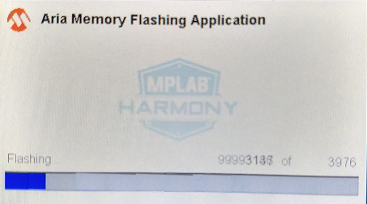

---
parent: Example Applications
title: Legato Flash
nav_order: 2
---

# Legato Benchmark

The legato_flash demonstration application serves as an external memory programmer to flash the off-chip non-volatile memory.

The legato_flash demonstration application serves as an external memory programmer to flash the off-chip non-volatile memory with the resources held on an Memory Storage Device (MSD), such as a USB or a SD card, which can then be accessed by other applications saving on-chip memory for other programs and resources.

The application legato_quickstart_external_resources in MPLAB Harmony needs to use preloaded images/fonts from QSPI flash external non-volatile memory. This would require legato_flash to flash the required image and font resources onto the QSPI flash. Refer to legato_quickstart_external_resources for usage model information.

This demonstration runs on:

|MPLABX Configuration|Board Configuration|
|:-------------------|:------------------|
|[legato_fl_e70_xu_tm4301b.X](./firmware/legato_fl_e70_xu_tm4301b.X/readme.md)|SAM e70 Evaluation Kit using LCC MCU DMA graphics controller to drive the [High-Performance WQVGA Display Module with maXTouch® Technology](https://www.microchip.com/DevelopmentTools/ProductDetails/PartNO/AC320005-4)|

 
